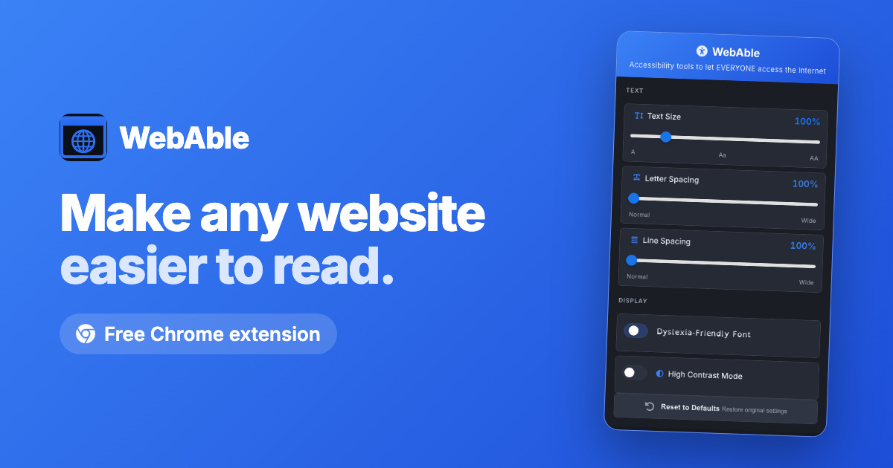

<p align="center">
  
</p>

<h1 align="center">WebAble</h1>

<p align="center">
  <strong>Accessibility tools to let everyone access the internet.</strong><br>
  Resize text, switch to a dyslexia-friendly font, open up spacing, and turn on high contrast — on any website, instantly.
</p>

<p align="center">
  <a href="https://chromewebstore.google.com/detail/webable-accessibility-ass/kbclhcipnkiohhbjiagecmckemkpaech">
    
  </a>
  <a href="https://web-able.vercel.app">
    
  </a>
</p>

---

## What is WebAble?

Around **15%** of the U.S. population has a learning disability, yet only about **5%** of the top one million web pages meet basic accessibility standards. Most accessibility tools fix just one thing and are complicated to use.

**WebAble** brings the essentials together in one simple popup. Open it on any page and adjust how the web reads — text size, font, spacing, and contrast — with changes applied live as you go. Everything is stored locally on your device; nothing is ever sent anywhere.

## Features

| Feature | What it does |
|---|---|
|**Adjustable text size** | Scale text from 80% to 200% |
|**Dyslexia-friendly font** | Switch any page to OpenDyslexic, a dyslexia-friendly font |
|**Letter & line spacing** | Open up the space between letters and lines to reduce crowding |
|**High contrast mode** | Force light-on-dark text to cut glare on low-contrast pages |
|**Applies instantly** | Every change shows up on the page as you make it |

## Install - Chrome Web Store
**[Add WebAble to Chrome](https://chromewebstore.google.com/detail/webable-accessibility-ass/kbclhcipnkiohhbjiagecmckemkpaech)** — free, one click.


## How it works

1. **Add WebAble to Chrome.**
2. **Open it on any page** by clicking the WebAble icon in your toolbar.
3. **Adjust to taste** — move the sliders and flip the toggles; the page updates as you go.

WebAble injects scoped CSS/DOM changes into the active tab and persists your preferences with `chrome.storage.local`. 

## Project structure

```
WebAble/
├── extension/   →  the Chrome extension (load this folder unpacked)
│   ├── manifest.json, popup.*, contentScript.js, background.js
│   └── styles.css, fonts/, icons/
└── landing/     →  the marketing website (https://web-able.vercel.app)
    ├── index.html, privacy.html, styles.css
    └── assets/  (icon, screenshots, social card)
```

## Privacy

WebAble collects **no** browsing history and **no** personal data. Your accessibility
preferences live only on your device. Full details: **[Privacy Policy](https://web-able.vercel.app/privacy)**.

